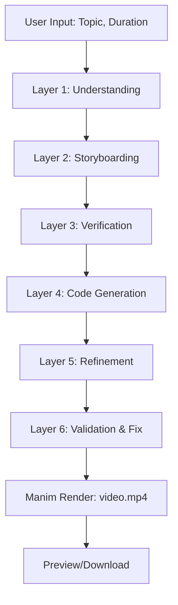

# MentorBoxAI: Project Notes & Deep Technical Walkthrough

---

## 🧠 What is Happening?
MentorBoxAI is a production-grade backend that turns any educational topic into a cinematic animated explainer video. It orchestrates a 6-layer AI pipeline, integrates AWS Bedrock LLMs, and renders with Manim CE—all wrapped in a modular FastAPI structure.

---

## 🔄 Why Use a Layered Pipeline?
- **Reliability:** Each layer adds structure, checks, and enhancements, reducing hallucinations and errors.
- **Clarity:** Stepwise processing ensures information is simplified, visualized, verified, and refined for learning.
- **Self-Healing:** If code fails, the pipeline auto-patches and re-validates, guaranteeing crash-free output.
- **Scalability:** Modular layers allow easy extension, testing, and CI/CD integration.

---

## 🏗️ Pipeline Services & Their Roles

### Pipeline Flow Diagram

#### Layer Details

1. **Understanding Layer**
   - Deconstructs topic into key facts and a cinematic script.
   - Uses prompt engineering and LLMs for deep reasoning.
   - Example: "Explain nuclear fusion in stars" → JSON script with facts, narrative, and learning objectives.
2. **Storyboarding Layer**
   - Maps script into a visual plan (scenes, objects, timings).
   - Ensures information density and screen-safe layouts.
   - Example: Scene breakdown with labeled objects, timings, and captions.
3. **Verification Layer**
   - Validates plan against technical and pedagogical constraints.
   - Checks for LaTeX, screen bounds, and cognitive load.
   - Example: Ensures no LaTeX, all objects fit screen, captions are readable.
4. **Code Generation Layer**
   - Translates storyboard into Manim Python code.
   - Uses few-shot prompting for consistent quality.
   - Example: Generates Manim class with procedural visuals, captions, and transitions.
5. **Refinement Layer**
   - Enhances visuals with effects and quality improvements.
   - Injects advanced styling and transitions.
   - Example: Adds glowing pulses, particle backgrounds, smooth transitions.
6. **Validation & Fix Layer**
   - Static and runtime validation, auto-patching for crash-free output.
   - Self-healing logic for error detection and correction.
   - Example: Runs smoke test, fixes NameError/ImportError, re-validates code.

---

## 🤖 LLMs Used & Techniques
- **AWS Bedrock Claude 3 Sonnet:** Main LLM for prompt engineering, script generation, plan validation, and code review.
- **Prompt Engineering:** Custom templates for each layer, optimized for exam content, clarity, and information density.
- **Few-Shot Examples:** Golden Manim code snippets used to guide LLM output for consistent, high-quality code.
- **Self-Healing:** LLMs are invoked to fix code errors automatically, ensuring reliability.

---

## 🛠️ Frameworks & Tools
- **FastAPI:** Modern Python web framework for REST API endpoints.
- **Manim Community Edition:** Python library for mathematical animation rendering.
- **boto3:** AWS SDK for Python, used to call Bedrock LLMs.
- **python-dotenv:** Loads environment variables for configuration.
- **Pydantic:** Data validation and serialization for API models.
- **Alembic:** Database migrations (optional, for future scalability).

---

## 📝 Key Project Points (Notes)
- Modular src/app structure for maintainability and scalability.
- All business logic is in services/, API endpoints in api/v1/endpoints.py, models in models/job.py.
- Prompt templates and few-shot examples are separated for clarity and easy extension.
- Output is organized into manim/ (scripts) and videos/ (rendered MP4s).
- Self-healing pipeline ensures zero runtime crashes and rapid iteration.
- Designed for hackathon, production, and educational use.

---

## 🧑‍💻 Practical Developer Notes
- To extend a layer, add new prompt templates or few-shot examples in services/.
- To add new endpoints, create them in api/v1/endpoints.py and validate with Pydantic models.
- To debug pipeline, check logs for each layer's output and validation status.
- To render videos, use Manim CLI with quality flags (see README).
- To scale, integrate Alembic for DB migrations and CI/CD for deployment.

---

## 📚 Further Reading
- See README.md for quickstart and troubleshooting.
- See DESIGN.md and UPDATED_ARCHITECTURE.md for deep dives into architecture and design.
- See requirements.md for full acceptance criteria and hackathon alignment.

---

## License
MIT
